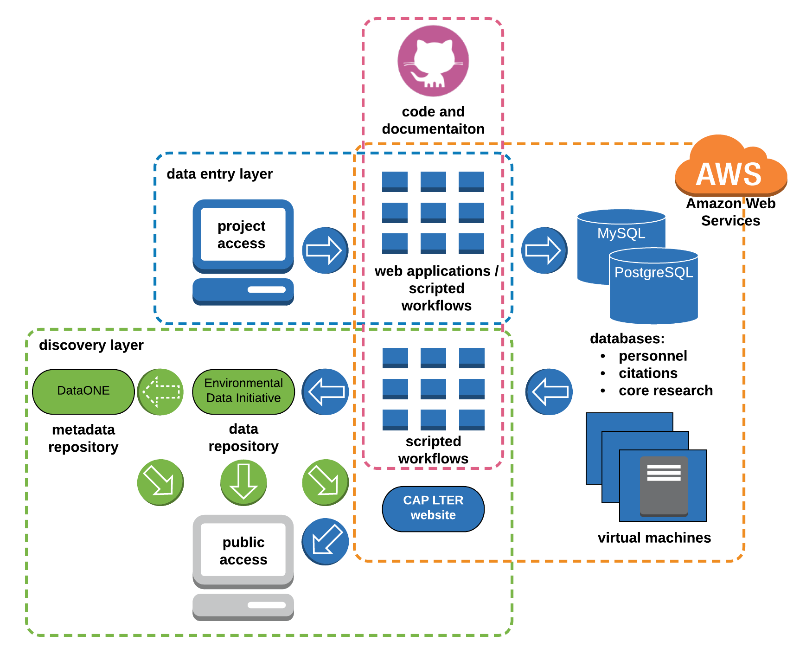
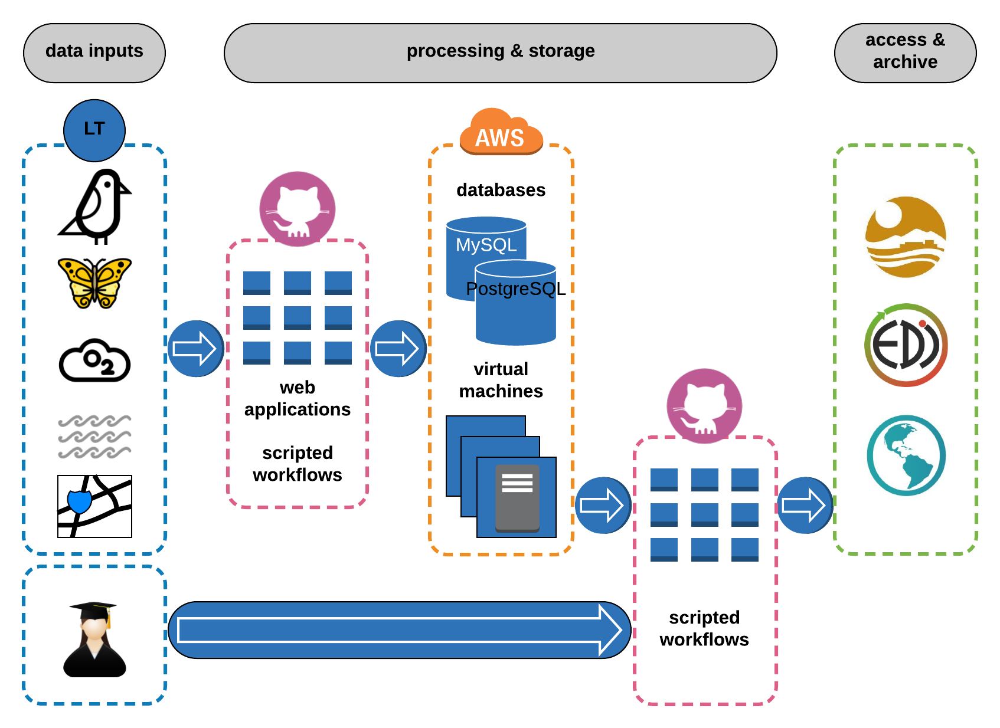
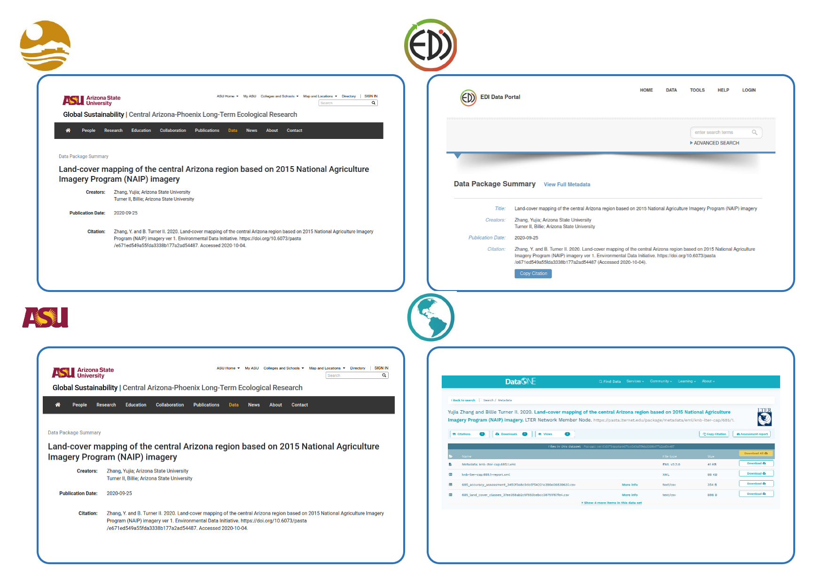
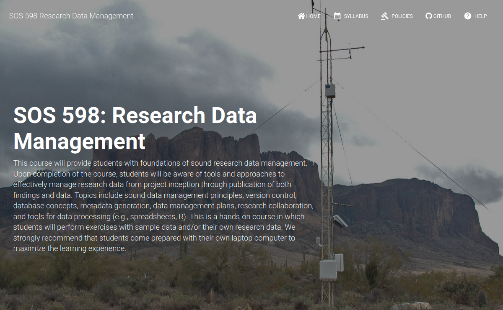
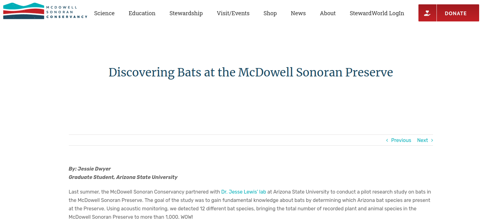

```{r setup, include=FALSE}
options(htmltools.dir.version = FALSE)
```

layout: true

background-image: url(assets/figures/template.png)
background-size: cover

---

.slide-title-font[information management at the CAP LTER]

**S. Earl**

**2020-10-21**


---

.slide-title-font[goals]

<style>
.middle {
  display: flex;
  justify-content: center;
  align-items: center;
  height: 400px;
  border: 1px solid gray;
}
</style>

.middle[
support CAP LTER data generation efforts
]

* support CAP LTER data generation efforts

--

* archive well-structured and -documented research data in a long-term data repository for the benefit of the scientific community, decision makers, and public

--

* enable and promote dataset discovery and access

--

* provide leadership and education on sound information management

???

# goals

---
class: top

.slide-title-font[infrastructure]

.center[
  
]

???

# infrastructure


---
.slide-title-font[workflow]

*from data generation to publication*

.center[
  
]

???

# workflow


---
.slide-title-font[data access]

.center[
  
]

???

# data access


---
.slide-title-font[data access]

.small[~ 24K file downloads]

.center[
  
]

???

# data use


---
.slide-title-font[education and leadership]

* events

* invited talks

* embed with labs

???

# outreach


---
.slide-title-font[education and leadership]

.center[
  
]

???

# RDM


---
.slide-title-font[education and leadership]

<br>
<br>

.center[
  
]

???

# bats


---
.slide-title-font[improving CAP IM]

* unified data publishing and discovery system with EDI as the primary repository for all CAP data

--

* tablet-based field data collection tools

--

* suite of R packages (capeml, capemlGIS, gioseml) to enable a completely scripted approach to EML generation

--

* consolidated workflows and documentation in cloud-based version control systems (GitHub, GitLab)

--

* emphasis on including the ORCiD identifiers of data contributors

???

# improving CAP IM


---
.slide-title-font[values]

* leverage community resources

--

* collaborate with the informatics community

--

* strive continuously to advance project goals


???

# values
