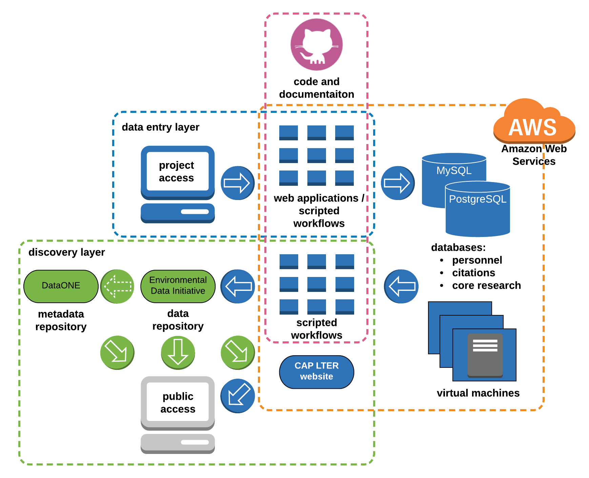

---
output:
  word_document: 
    reference_docx: report_format.docx
---

<!--
IV. Information Management
  a. Overview of CAP's information management structure & approach
  b. Availability of data, metadata, and other relevant digital products
  c. Timeliness of relevant data being incorporated into the CAP database,
  including student data
  d. Other accomplishments in the last 4 years
-->

# information management

Information Management (IM) is an integral component of the CAP LTER project with the overarching goals of: (1) supporting data collection; (2) archiving well-structured and -documented research data in a long-term data repository for the benefit of the scientific community, decision makers, and public; (3) enabling and promoting dataset discovery and access; and (4) providing leadership and education on sound data management. CAP maintains high standards for data archival and documentation to ensure the quality of the scientific data and metadata produced. The Information Manager works with CAP scientists, students, and staff in a variety of capacities to address data management throughout the knowledge-generating enterprise from research design to data publication. CAP is an active contributor to LTER-Network IM, and adheres to all NSF and LTER Network data policies.

## a. overview of CAP's information management structure & approach

_structure_

CAP leverages a diverse suite of technologies and resources to meet the project's IM requirements (Fig. 1). The Information Manager works closely with ASU Knowledge Enterprise, which provides web-, application-, and database-services hosted on virtual Linux servers in the Amazon Web Services (AWS) ecosystem. These resources host the CAP website, other web resources (e.g., personnel and citation databases, CAP's equipment reservation system, web-based data-entry applications), and centralized databases (MySQL, PostgreSQL) with appropriate access control, security, and recovery. ASU maintains an institutional agreement with Dropbox, which provides CAP with unlimited storage, and is used for document storage and as a collaboration tool. All networked systems and web applications are password-protected, and ASU performs regular security sweeps to identify vulnerabilities or suspect behavior. Organizational GitHub and GitLab accounts house project code, informatics documentation, and, increasingly, project documentation.

```{r cap-infrastructure, echo=FALSE, out.width="75%", fig.cap="CAP LTER Information Management infrastructure and workflow"}


```

_data collection and assurance_

CAP employs a combination of tools and workflows to facilitate data collection, processing, transfer, and storage of data generated by CAP's long-term monitoring and experiment (core) programs. Most field data are collected with pre-formatted field sheets or tablets. Data collected with tablets are uploaded to CAP databases with scripted (R) workflows. Observational data (e.g., bird surveys) recorded on field data-sheets are double-entered into the CAP databases via web-based data-entry applications developed with Ruby-on-Rails or Shiny. These tools are tuned to optimize workflow efficiency and quality control at the time of entry. Data generated from our analytical laboratory (Goldwater Environmental Lab) undergo rigorous quality control at the time of analysis. These data and data from sensor platforms (e.g., micrometeorological stations) are uploaded to databases using web-entry tools (Shiny) or processed with scripted (R) workflows for efficient transfer of data to CAP databases while applying additional quality-control measures. Many analytical workflows employ barcodes on samples, which greatly increases processing efficiency and minimizes data recording and transfer errors. All source materials (e.g., field data sheets (scanned), sensor downloads) are archived in Dropbox for redundancy. All scripted tools and workflows are documented in GitHub or GitLab.

For novel datasets, investigators submit data and metadata with forms that are available on the CAP website along with submission instructions. The Information Manager works with data providers to address data and metadata issues to produce high-quality, well-documented datasets with the goal of maximizing the potential reuse of the data. All datasets are processed with scripted workflows to ensure complete traceability of data processing. In addition to the published dataset, all materials contributed as part of the data submission, and processing scripts and documentation are archived in Dropbox.

_data description_

Metadata, stored as XML files, are encoded in the newest version (2.2.0) of the Ecological Metadata Language (EML) schema. Dataset EML metadata are generated using a suite of publicly-accessible R packages (capeml, capemlGIS). An additional R package (gioseml) facilitates pulling investigator details from the Global Institute of Sustainability and Innovation (GIOSI) database. The integrity of CAP metadata is maintained through careful review, and evaluation using the quality-control checks within the Provenance Aware Synthesis Tracking Architecture (PASTA+) system that ingests data into the Environmental Data Initiative (EDI) data repository. To maximize discoverability and interoperability with other ecological data, dataset keywords are mapped as closely as possible to the LTER Controlled Vocabulary, and measurement units are aligned with the LTER Unit Dictionary or otherwise detailed according to LTER Best Practices. The Information Manager works with a wide array of data types (e.g., tabular, spatial, imagery), with these data types often commingled in dataset packages. This approach aids ease-of-use by eliminating the need for data users to download multiple datasets to obtain, for example, tabular and spatial components of a project.

## b. availability of data, metadata, and other relevant digital products

CAP is committed to maximizing the availability of its research products, and adheres to the LTER Network Data Access Policy. Per the policy, most data are publicly available (Tier I). Only copyright-protected, third-party data, and human-subject data that cannot be anonymized are not public (Tier II). Tier II data may be available by request at the discretion of the data provider.

By default, CAP datasets are published in the EDI data repository, and are discoverable and accessible through several resources. The primary access point for CAP data is the data catalog on the project website. The catalog is populated from CAP datasets in EDI through a deployment of the PASTA+ architecture along with Apache Tomcat on an AWS server that retrieves CAP datasets from the EDI repository and makes them available through the catalog interface on the CAP website. CAP data are available through a similar data catalog on the GIOSI website that features CAP data and non-CAP GIOSI data published in EDI. As CAP datasets are published in the EDI data repository, they are discoverable and accessible through the EDI Data Portal, and through DataONE by extension of EDI's participation as a member node.

## c. timeliness of relevant data being incorporated into the CAP database

Revisions of CAP's long-term (core) data are released at approximately annual intervals. Per the LTER Network Data Access Policy, investigators providing data from individual research projects (e.g., student research) are expected and encouraged to submit their data with two years of project completion, or sooner if in conjunction with publication of an associated journal article(s). 

## d. other accomplishments in the last 4 years

- A unified data publishing and discovery system with EDI as the primary repository for all CAP data. A CAP data catalog that is populated by data in EDI is a relatively new implementation, replacing a previous version of the CAP data catalog that drew from a local index of datasets and custom styling of XML metadata files for display. The new approach has numerous advantages, including: (1) mirroring the rich search and display features of the EDI Data Portal; (2) ensuring that CAP datasets published in EDI are the authoritative versions; and (3) greatly streamlining dataset management by eliminating a redundant system.
- To foster data literacy and promote sound data management skills, the current (S. Earl) and a former (P. Tarrant) CAP Information Manager launched a semester-long research data management methods course offered through ASU's School of Sustainability. Taught each spring semester since 2016, the course is well attended by CAP students.
- Developed tablet-based field-data collection tools for a subset of long-term (core) monitoring programs, which greatly improves speed and efficiency of information transfer from the field to CAP databases.
- Developed a suite of R packages (capeml, capemlGIS, gioseml) to facilitate a completely scripted approach to EML generation.
- Consolidated CAP IM workflows and documentation in cloud-based version-control systems (GitHub, GitLab).
- Created a Slack team to improve project communication.
- CAP strives continually to improve data and metadata quality, a notable advancement in this regard is a strong emphasis on including the ORCiD identifiers of data contributors.


----

## network contribution

CAP is committed to making a strong contribution to informatics within the LTER Network and the ecological sciences generally. The Information Manager participates in all network information meetings and activities, serves as co-chair of the LTER Information Management Executive Committee (IM Exec), contributes to community-wide efforts (e.g., is a contributing author of Ecological Metadata Language version 2.2.0), participates in and presents at numerous scientific conferences, and contributes to scientific- and informatics-focused publications. In addition, S. Earl is the embedded data manager for an LTER synthesis working group addressing soil organic matter dynamics, and is contributing to numerous products directly and indirectly related to that research effort.
